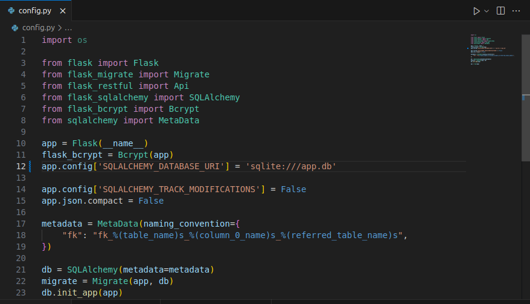
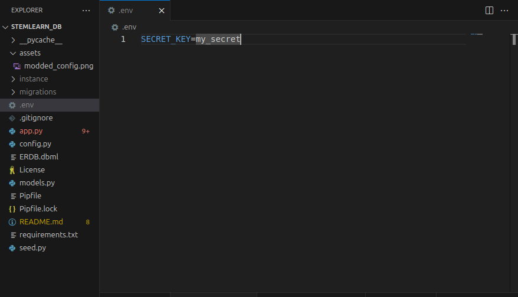
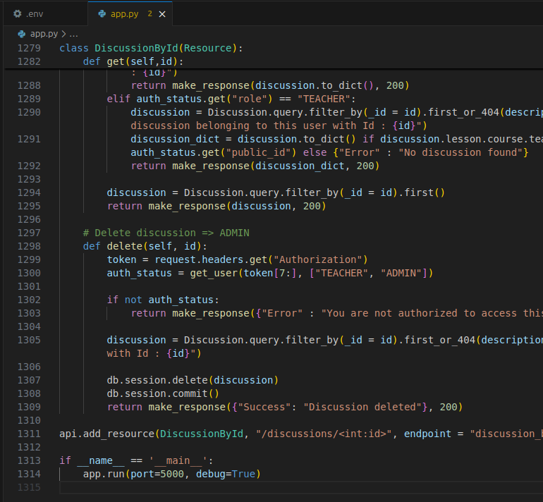

# STEMLearn

STEMLearn is a Python Flask-based backend for a web-application that aims to provide free, accessible learning platform for students from underprivileged backgrounds. This app implements JWT for user authentication and access-management.

## Table of Contents

- Installation
- Usage
- API Documentation
- Contributing
- License

### Prerequisites

- Python 3.8.13
- pipenv (a tool that provides all necessary means to create a virtual environment for your Python project)

## Installation & Setup

### 1. Clone this repository

```bash
$ git clone https://github.com/Zippy-sudo/STEMLearn_db.git
$ cd STEMLearn_db
```

### 2. Install dependecies and enter virtual environment

```bash
$ pipenv install && pipenv shell
```

### 3. Intialize the database and seed data

- First navigate to config.py. Modify line 12 so that it reads this way:



- In your terminal run:

```bash
$ flask db init
$ flask db migrate
$ flask db upgrade
```

- Then run:

```bash
$ python seed.py
```

- Check the instance folder to confirm that a database file has been created.

### 4. Set-up Environment Variables

In the root of the STEMLearn_db folder, create a .env file and populate it with a secret key, like so:



## Usage

### Running the Development Server

To start the Flask development server:

```bash
python app.py
```

This will start the application on http://127.0.0.1:5555

You can specify the port by modifying the last line in app.py, like so:



## API Documentation

### Authentication & Authorization

There is only one Administrator in the database. Check the seed.py file for user details.

### Endpoints

#### login

- Post - Only users in the database can use this route. The response is a jwt token containing the users public_id signed using a secret key, and the user's role.

#### signup

- Post - Anyone can access this route. The response is a jwt token containing the users public_id signed using a secret key, and the user's role - STUDENT.

#### unauthCourses

- Get - Anyone can access this route. The response is a shortened form of the response from the courses endpoint.

#### users

- Get - Gets a list of all users. Only the Administrator and Teachers can access this route using this method.

- Post - Creates a new user. Only the Administrator can access this route using this method.

#### users/string:id

- Get - Gets a single user by their unique public_id. Only Administrator and Teachers can access this route using this method.

- Patch - Updates a single user by their unique public_id. Only the Administrator can access this route using this method.

- Delete - Deletes a single user by their unique public_id. Only the Administrator can access this route using this method.

#### enrollments

- Get - Gets a list of all enrollments. Everyone can access this route using this method.

- Post - Creates a new enrollment. Only the Administrator and Students can access this route using this method.

#### enrollments/int:id

- Get - Gets a single enrollment by its unique id. Only Administrator and Teachers can access this route using this method.

- Patch - Updates a single enrollment by its unique id. Only the Administrator can access this route using this method.

- Delete - Deletes a single enrollment by its unique id. Only the Administrator can access this route using this method.

#### courses

- Get - Gets a list of all courses. Everyone can access this route using this method.

- Post - Creates a new course. Only the Administrator can access this route using this method.

#### courses/int:id

- Get - Gets a single course by its unique id. Everyone can access this route using this method.

- Patch - Updates a single course by its unique id. Only Administrators and Teachers can access this route using this method.

- Delete - Deletes a single course by its unique id. Only the Administrator can access this route using this method.

#### certificates

- Get - Gets a list of all certificates. Only the Administrator and Students can access this route using this method.

- Post - Creates a new certificate. Only the Administrator can access this route using this method.

#### certificates/int:id

- Get - Gets a single certificate by its unique id. Only the Administrator can access this route using this method.

- Patch - Updates a single certificate by its unique id. Only the Administrator can access this route using this method.

- Delete - Deletes a single certificate by its unique id. Only the Administrator can access this route using this method.

#### progresses

- Get - Gets a list of all progresses. Only the Administrator and Students can access this route using this method.

- Post - Creates a new progress. Only the Administrator and Students can access this route using this method.

#### progresseses/int:id

- Get - Gets a single progress by its unique id. Only the Administrator can access this route using this method.

- Patch - Updates a single progress by its unique id. Only the Administrator can access this route using this method.

- Delete - Deletes a single progress by its unique id. Only the Administrator can access this route using this method.

#### lessons

- Get - Gets a list of all lessons. Everyone can access this route using this method.

- Post - Creates a new progress. Only the Administrator and Students can access this route using this method.

#### lessons/int:id

- Get - Gets a single lesson by its unique id. Everyone can access this route using this method.

- Patch - Updates a single lesson by its unique id. Only the Administrator and Teachers can access this route using this method.

- Delete - Deletes a single lesson by its unique id. Only the Administrator can access this route using this method.

#### quizzes

- Get - Gets a list of all quizzes. Everyone can access this route using this method.

- Post - Creates a new quiz. Only the Administrator can access this route using this method.

#### quizzes/int:id

- Get - Gets a single quiz by its unique id. Everyone can access this route using this method.

- Post - Gets a single quiz by its unique id. Only the Students can access this route using this method.

- Patch - Updates a single lesson by its unique id. Only the Administrator and Teachers can access this route using this method.

- Delete - Deletes a single lesson by its unique id. Only the Administrator can access this route using this method.

#### activities

- Get - Gets a list of all activities. Only the Administrator and Teachers can access this route using this method..Everyone can access this route using this method.

- Post - Creates a new activity. Everyone can access this route using this method.

- Delete - Deletes all activities. Only the Administrator can access this route using this method.

#### activities/int:id

- Get - Gets a single activity by its unique id. Only the Administrator can access this route using this method.

- Delete - Deletes a single activity by its unique id. Only the Administrator can access this route using this method.

#### resources

- Get - Gets a list of all resources. Everyone can access this route using this method.

- Post - Creates a new resource. Only the Administrator and Teachers can access this route using this method.

#### resources/int:id

- Get - Gets a single resource by its unique id. Everyone can access this route using this method.

- Patch - Updates a single resource by its unique id. Only the Administrator and Teachers can access this route using this method.

- Delete - Deletes a single resource by its unique id. Only the Administrator can access this route using this method.

#### assignments

- Get - Gets a list of all assignments. Everyone can access this route using this method.

- Post - Creates a new assignment. Only the Students can access this route using this method.

#### assignments/int:id

- Get - Gets a single assignment by its unique id. Everyone can access this route using this method.

- Patch - Updates a single assignment by its unique id. Only the Administrator and Teachers can access this route using this method.

- Delete - Deletes a single assignment by its unique id. Only the Administrator can access this route using this method.

#### discussions

- Get - Gets a list of all discussions. Only the Administrator and Teachers can access this route using this method.

- Post - Creates a new discussion. Everyone can access this route using this method.

#### discussions/int:id

- Get - Gets a single discussion by its unique id. Everyone can access this route using this method.

- Delete - Deletes a single discussion by its unique id. Only the Administrator can access this route using this method.

## Contributing

If you want to contribute to the project. Please:

1. Fork this repository.

2. Clone your Fork.

3. Create a new branch:

    ```bash
    $ git switch -c your_branch_name
    ```

4. Make your changes.

5. Add and commit your changes:

    ```bash
    $ git add .
    $ git commit -m "Your commit message"
    ```

6. Push your changes:

    ```bash
    $ git push origin your_branch_name
    ```

7. Create a new pull request.


## License

MIT License - see [LICENSE](LICENSE) for more details.
